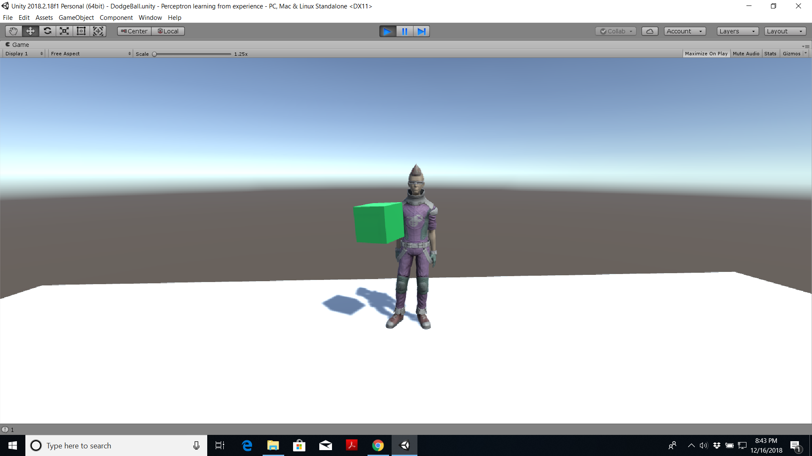

# Programming and Training a Perceptron

I have been taking this online course https://www.udemy.com/machine-learning-with-unity/ taught by Dr Penny de Byl. The course is really good if you want to learn about Machine Learning and Game development using Unity Game Engine.

# What is included in the repository?

I learned how to program and train a perceptron. We have a character and we train the character to dodge only when a red sphere is thrown at it. The character learns over time that he needs to dodge when a red sphere is thrown at him and not react to anything else. The codes are included. (These are not my codes. I just followed the lecture by Dr. Penny de Byl). Look into the pictures below.

